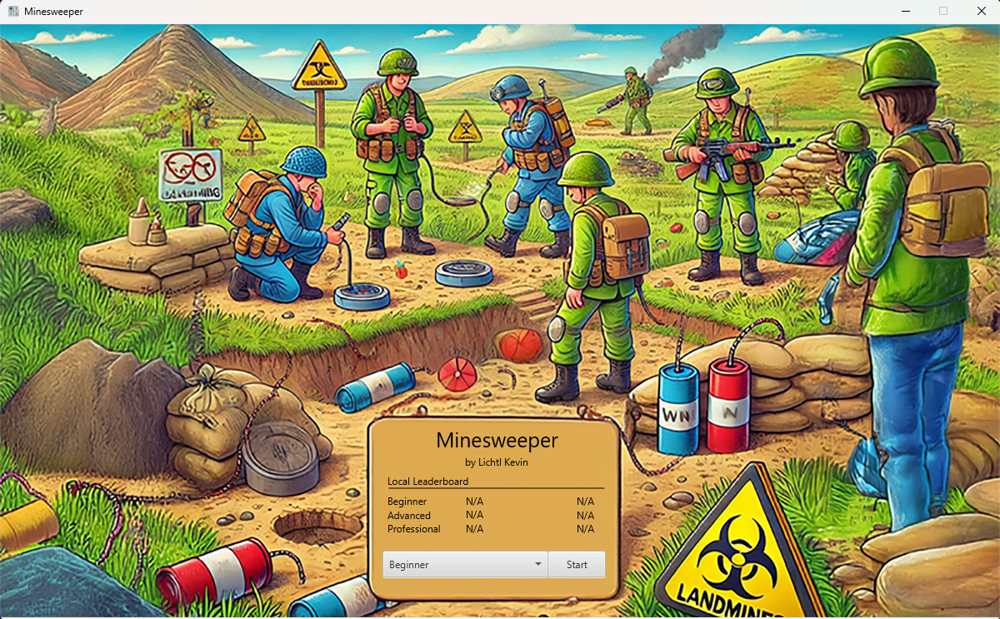
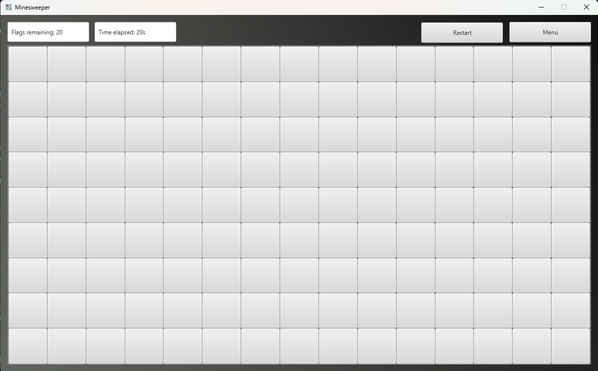
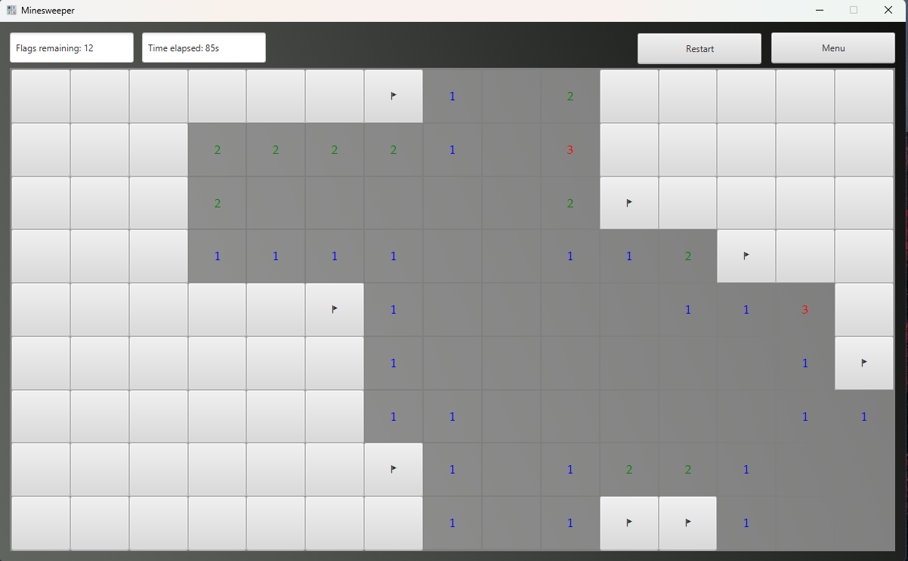
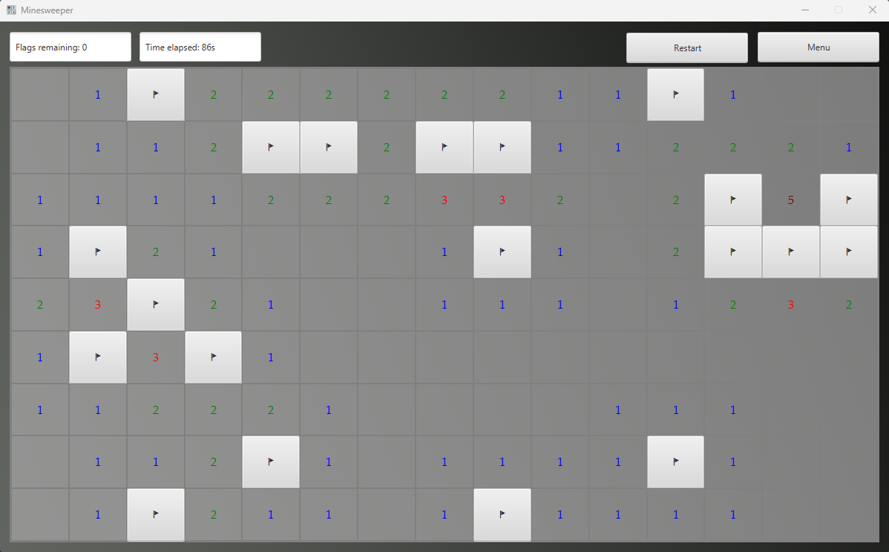

# Minesweeper

***

## Description of the Minesweeper-Logic

This is a classic implementation of the Minesweeper game using JavaFX.  
The player’s goal is to uncover all non-mine fields without triggering a mine.  
The game ends when either all non-mined fields are revealed or a mine is triggered.

***

## Features

+ Three Difficulty Levels: Chose between: Beginner, Advanced and Professional.
+ Timer: Track your time as you play. The game will record the time elapsed.
+ Mine Flags: You can flag fields as suspected mines.
+ Game Over Screen: Displays whether you win or lose, along with your time, and the option to save your results.
+ Highscore Table: The users with the best time, per difficulty gets displayed in the menu.

***

## How to play

1. Start the game
    + When starting the game, you will see the menu, where you can choose your preferred Difficulty.

    <p align="left">
      
    </p>

    + Click the Start Button to switch to the Game.

    <p align="left">
      
    </p>

2. Gameplay
    + Click on a Cell to reveal it (the first Cell will always be an empty field).

    <p align="left">
      
    </p>

    + Now you will see a bunch of numbers; these represent how many Mines are nearby.
    + Right-click on a Cell to set a Flag if you think there is a Mine underneath.

    <p align="left">
      
    </p>

3. Win Conditions
    + The game is won if you have revealed all non-mine fields and marked all mine fields.

    <p align="left">
      
    </p>

4. Save your Result
    + After winning, you will have the option to save your time, as well as your Username.

    <p align="left">
      
    </p>

***

## How to play it on your Device

1. Clone the repository
    ```bash
    git clone https://github.com/klichtl/klichtl_Minesweeper
    ```
2. Open the project in your preferred IDE (like IntelliJ, VS-Code, ...)
3. Run the Application

***

## Author

Lichtl Kevin

***